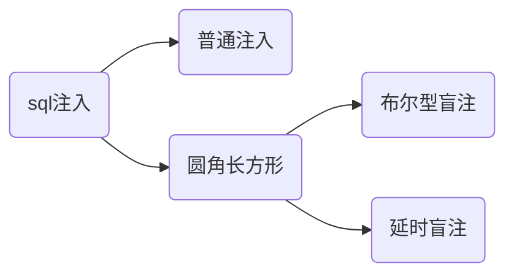

​	本文主要对手工方式sql注入进行介绍，包括sql注入的介绍和分类、sql注入中常用的关键字与敏感函数、经典的手工注入、利用sql注入进行文件的写入与读取等几部分。

​	后续的sql注入系列文章还将对使用sqlmap进行sql注入以及进行sql注入过程常见的一些关键问题做阐述，可以参见后面的文章：

- [sql注入——sqlmap6步注入法]()
- [sql注入——通过sqlmap进行getshell常见的问题]()

### sql注入介绍与分类

​	

​	常见的sql注入主要分从注入结果的展现形式上分为普通注入和盲注两大类。最简单也是最常见的就是普通话的sql注入了，这种注入方式进行注入有直观展示的结果进行结果展示，一般可以直接使用union语句进行联合查询获取信息上传文件等操作，后续在[经典手工注入流程](#经典手工注入流程)中讲述的就是使用普通注入进行sql注入。

​	另外一大类sql注入就是盲注，这种sql注入方式一般用于页面并没有对sql注入的查询结果直接进行返回，只能通过返回的一些其他信息判断注入的片段是否正确进行了执行。其中根据页面返回的布尔值(页面是否正确返回)进行sql注入称为**布尔型盲注**，根据页面返回时间的差异确定注入是否成功的sql注入称为**延时盲注**。下面是一个最常用延时注入的例子：

在上面的例子中，再过个浏览器控制器的控制台中，可以看到该请求存在着10s左右的等待时间，也即是说明我们前面的进行拼遭的sql注入语句正确的进行了执行，因此可以判断该部分是一个可以进行利用的注入点。本文重点介绍一般的注入，关于盲注的具体使用将在后续的文章中进行介绍。

### 2.sql 注入中常用的关键字和系统表

#### sql注入中常用到的sql关键字

|    表达式    |                描述                |
| :----------: | :--------------------------------: |
|    union     | 将查询结果进行联合输出，追加在列尾 |
|  union all   |                                    |
|     load     |              文件读取              |
| into outfile |              文件写入              |
|  @@datadir   |         数据库文件存放路径         |
|    user()    |              当前用户              |
|  version()   |             数据库版本             |
|  database()  |             数据库名称             |
|   sleep(n)   |            延时执行n秒             |

> @@表示系统变量

#### mysql中常用的系统表

|       数据库       |  表名   |                         描述                          |                                                         |
| :----------------: | :-----: | :---------------------------------------------------: | ------------------------------------------------------- |
| information_schema | tables  |  mysql中存储的全部表名，使用table_schema指定数据库名  | select table_schema.tables where table_scheama=数据库名 |
| information_schema | columns | mysql中存储全部其他表的字段名，使用table_name指定表名 | select information_schema.columns where table_name=表名 |

> Information_schema是mysql中自带的一个数据库，这个数据库中包含了其他数据的各种信息，包括数据库中的表名、权限、字段名等。

### 3.经典手工注入流程

#### 1.注入点测试

​	注入点测试主要分为**是否存在sql注入检测**与**sql注入类型检测**两个部分。**要检测时候否存在sql注入**只需要在要进行检测的参数后面加单引号，看是会因’个数不匹配而报错（这里的报错不一定是真的报错，可能只是页面不在正常显示之前的内容也可以看做报错的一种）。

~~~shell
http://xxx/abc.php?id=1'
~~~

​	sql注入的注入点的类型主要分为数字型注入点和字符型注入点两种，分别对应着要进行sql注入的参数值在数据库中存储的类型是字符型还是数字型，直接影响到后面进行后续的注入的一些细节。

##### 数字型检测

​	当输入变量的类型为数字类型时，可以使用and 1=1和and 1=2配合进行注入点类型进行检测:

> 1. Url 地址中输入 `http://xxx/abc.php?id= x and 1=1` 页面依旧运行正常，继续进行下一步。
> 2. Url 地址中继续输入 `http://xxx/abc.php?id= x and 1=2` 页面运行错误，则说明此 Sql 注入为数字型注入。

原因为:

> 如果当前注入点类型为数字型，	
>
> ​	当输入 `and 1=1`时，后台执行 Sql 语句：`select * from <表名> where id = x and 1=1 `,没有语法错误且逻辑判断为正确，所以返回正常。
>
> ​	当输入 `and 1=2`时，后台执行 Sql 语句：`select * from <表名> where id = x and 1=2`,没有语法错误但是逻辑判断为假，所以返回错误。
>
> 而如果该注入点类型为字符型，
>
> ​	当输入`and 1=1`和 `and 1=2`时，后台执行sql语句：`select * from <表名> where id='x and 1=1'`和 `select * from <表名> where id='x and 1=1`,将and语句作为字符进行id匹配，应该都没有查询结果，与事实不符因此该注入点为数字型注入点。

##### 字符型注入点检测

当输入变量为字符型时，可以使用'' and '1'='1和 ' and '1'='2配合进行注入点类型检测：

> 1.Url 地址中输入 `http://xxx/abc.php?id= x' and '1'='1` 页面依旧运行正常，继续进行下一步。
>
> 2.Url 地址中继续输入 `http://xxx/abc.php?id= x' and '1'='2'` 页面运行错误，则说明此 Sql 注入为数字型注入。

原因与上面的数字型注入点检测原理类似，这里就不进行详细讲述了，感兴趣的读者可以自己尝试解释一下。

#### 2.当前表行数测试

​	这里之所以要进行数据表行数测试是因为后面使用union进行联合查询时，明确后面要进行合并查询的列数。

要进行列数测试要使用order by进行测试，不断增加后面的数字，直到出错为止。

~~~shell
http://xxx/abc.php?id=x order by 8
~~~

下面为使用dvwa进行注入测试时的行数测试为例，当使用oder by 1和2时，页面正常显示

当将数字升到3是，产生如下报错，因此我们可以知道该表中只有两行。

#### 3.测试当前表中那些列有回显

~~~mysql
# and 1=2为了不展示本改进心跳查询的内容，只展示union进行联合查询的内容
# 最后的#是为了闭合本来sql语句中后面的‘
http://xxx/abc.php?id=x and 1=2 union select 1,2#
~~~

这里dvwa表中本身就只有两列数据全部在前台进行显示

#### 4.查询数据库名称

​	查询当前数据库名称我们可以直接使用数据库内置函数database()进行获取，利用该函数进行当前数据库名称获取的典型注入代码如下所示:

~~~mysql
# 这里将database函数卸载第二个参数位置处，将在第二个参数展示的位置进行展示。也可以写在第一个参数位置
http://xxx/abc.php?id=x and 1=2 union select 1,database()#
~~~

​	这里获取到了mysql中存在着名为dvwa的数据库

#### 5.数据表名获取

​	 表名获取利用系统自带数据中（mysql中的information_schema）中的tables表中的内容进行获取。tables表中常用的字段如下表所示：

| 数据表 | 字段         | 含义               |
| ------ | ------------ | ------------------ |
| tables | table_schema | 字段所属的数据库名 |
| tables | table_name   | 字段所属的表名     |

​	使用下面的语句进行表名探索：

~~~mysql
http://xxx/abc.php?id=x and 1=2 union select 1,table_name from information_schema.tables where table_schema='dvwa'#
~~~

#### 6.字段获取

​	字段获取利用系统自带的数据库（mysql中的information_schema）中的columns表中内容进行获取。columns表中常用字段如下表所示：

| 数据表  | 字段         | 含义               |
| ------- | ------------ | ------------------ |
| columns | table_schema | 字段所属的数据库名 |
| columns | table_name   | 字段所属的表名     |
| columns | column_name  | 字段名称           |

​	使用下面语完成对指定表中的字段名称进行探索：

~~~mysql
http://xxx/abc.php?id=x and 1=2 union select 1,column_name from information_schema.columns where table_schema='dvwa' and table_name='users'#
~~~

​	从上面的例子中我们可以看到在users表中存在着User和Password两个字段保存着网站管理员的用户和密码，接下来就可以直接对这两列的内容进行获取了。

#### 7.读取关键字段

~~~mysql
http://xxx/abc.php?id=x and 1=2 union select user,password from dvwa.users #
~~~

### 4.文件的写入读取

​	除了上面的基本的注入步骤外，找到注入点后还可以直接利用sql注入漏洞进行进一步的文件相关操作，可以直接通过sql注入实现对文件的读取与写入，利用文件的写入功能实现webshell的上传、系统用户名密码获取等功能。

#### 读取文件

​	在具有文件写入权限时常常可以直接使用进行文件读取，读取到文件后可以xxx

~~~mysql
=1' and 1=2 union select laod_file('/etc/password') #
~~~

#### 文件写入

​	在具有文件写入权限时可以使用文件读取命令写入小马文件，获取shell。

~~~shell
=1 and 1=2 union select ’小马文件内容‘into outfile '文件目录+文件名'
~~~

